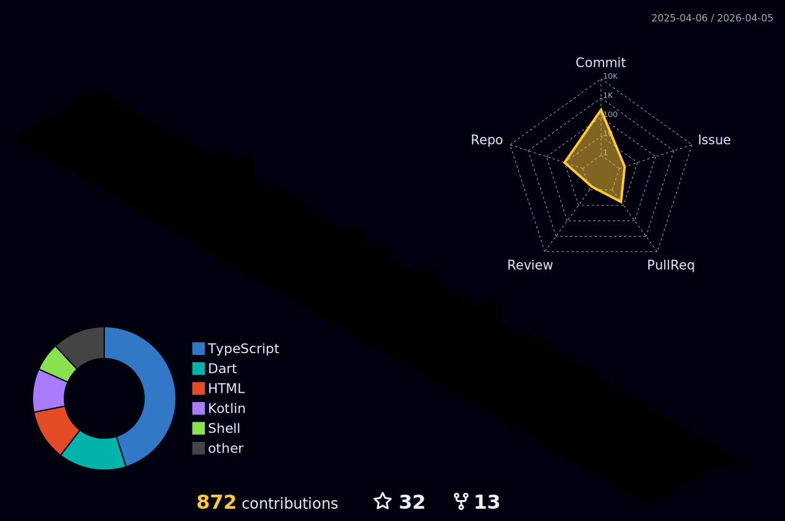

<h1 align="center">Hi 👋, I'm Enes</h1>
<h3 align="center">A passionate developer from Turkey</h3>

- 🔭 I’m currently working on **SOLVENT**

- 🌱 I’m currently learning **.NET, Python, React**

- 📫 How to reach me **nsyagz@gmail.com**
<h3 align="left">Profiles:</h3>

    

    

