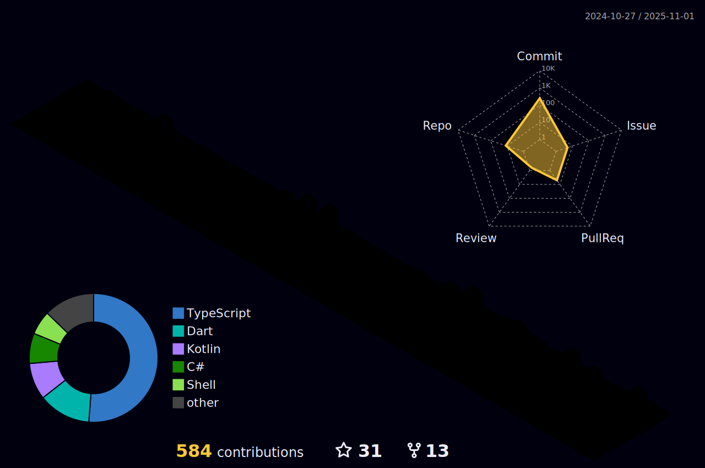

<h1 align="center">Hi 👋, I'm Enes</h1>
<h3 align="center">A passionate developer from Turkey</h3>

- 🔭 I’m currently working on **.NET Technology**

- 🌱 I’m currently learning **.NET, Python, Vue.js, React**

- 📫 How to reach me **nsyagz@gmail.com**

<h3 align="left">Languages and Tools:</h3>

           
</a> 

